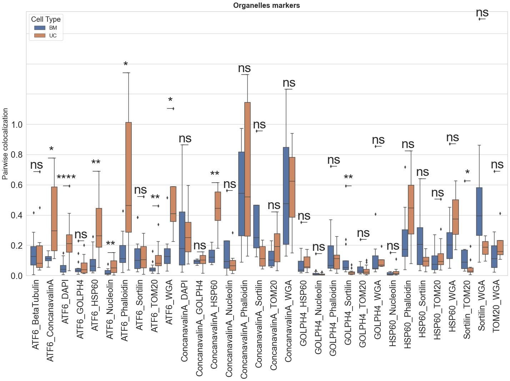
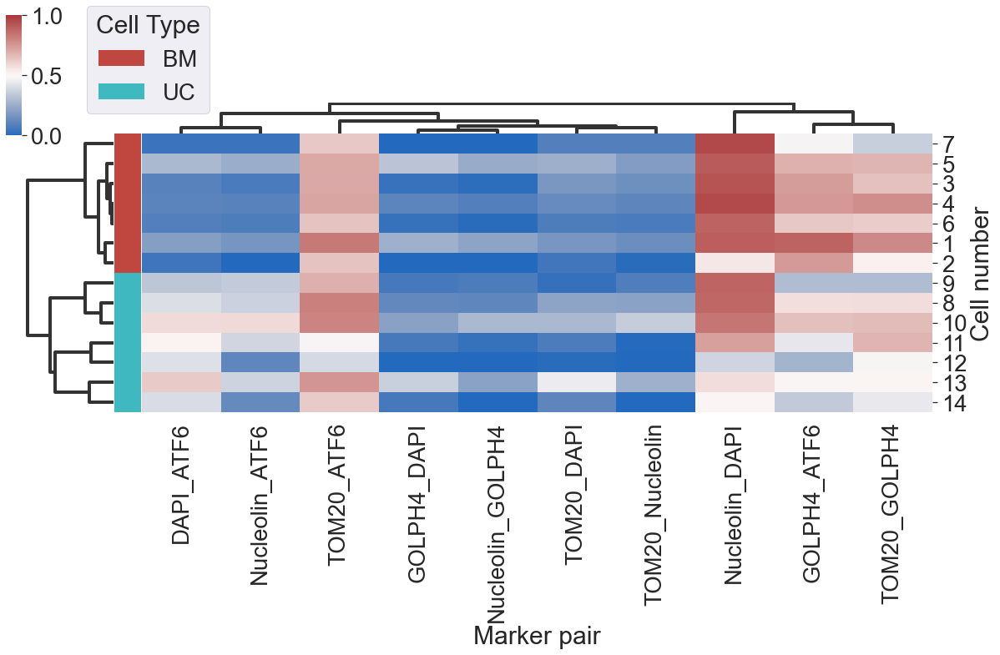
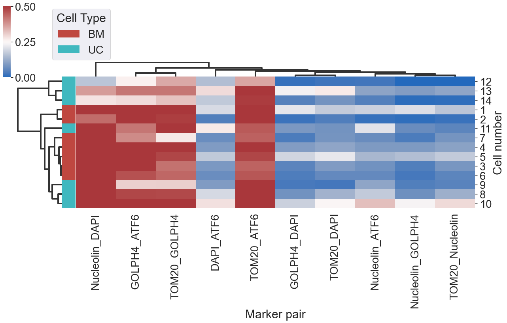
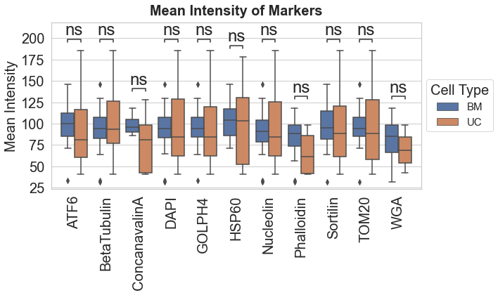
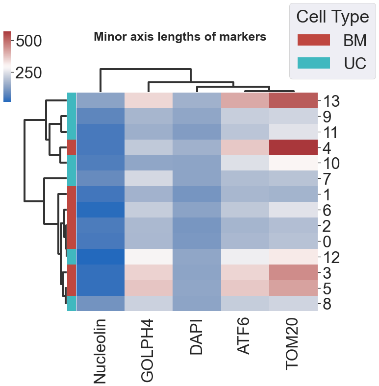
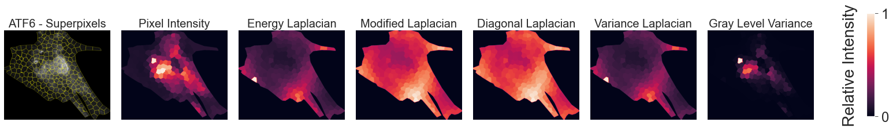
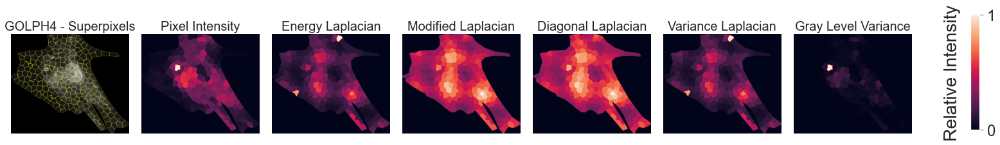

# Spatial-organelle-networks
Data and code for "Spatial subcellular organelle networks in single cells"

We used multiplex proteomics on 7 bone marrow derived mesenchymal stem cells (BM MSCs) and 7 umbilical cord derived mesenchymal stem cells (UC MSCs) to examine subcellular differences in organelle expression. The organelles of interest were mitochondria, endoplasmic reticulum (ER), Golgi, and nucleus.

Here is an example of organelle localization with KMeans clustering (n = 10) for one BM MSC:

Here is an example of organelle localization with KMeans clustering (n = 10) for one UC MSC:

The 10 KMeans clusters are shown in the large left panel. Each of the smaller image pairs shows the two antibody labels that target the specific organelle (right) and then the pixel wise multiplication of those two markers to reveal the localization of the entire organelle (left).  Example: TOM20 and HSP60 colocalize to illustrate the mitochondria.

Quantitatively, we measured subcellular organelle colocalization with 1) Pearson's Correlation and 2) Pixel overlap colocalization (number of share pixels divided by the area of the cell).  We compare the pairwise antibody colocalization for Pearson's:

And for pixel overlap colocalization:

These colocalization metrics can be shown on a single cell basis as well. Here is the Pearson's correlation for all 14 cells:

And the pixel overlap colocalization for all 14 cells:

We also examine organelle area and intensity patterns between the MSC cell types:

Within individual cells, we performed Komolgorov Smirnov Hypothesis Testing to determine if a single cell expresses two antibodies in spatially distinct patters.  These two antibodies target the same organelle. For example, HSP60 and TOM20 both label the mitochondria. We determine if HSP60 and TOM20 are expressed in significantly different spatial patterns for BM MSCs:

And UC MSCs:

In addition, we measure morphological traits of the organelles such as area, minor axis, and major axis:

Finally, we visually confirm organelle localization with superpixel segmentation and texturing in a single cell:

# Organization

## Data
"data" folder contains all the necessary data to reproduce the results in the paper:
- "cell_profiler" contains the morphological attributes measured in CellProfiler: area, major axis, minor axis, etc.
- "vr_visualization" contains 3D image files and histogram counts across the cell used in Virtual Reality

## Notebooks 
"notebooks" folder contains jupyter notebook script used:
- 01_pearsons_correlation computes Pearsons Correlation across markers and cells
- 02_pixel_overlap computes pixel overlap colocalization across marker and cells
- 03_kmeans_clustering computes KMeans clustering on single cells and computes correlation between markers and clusters
- 04_ksTest calculates the Komolgorov-Smirnov Hypothesis Test between similar markers to determine if a single cell expresses them differently
- 05_cellprofiler_plots performs hierarchial clustering in heatmaps for the morphological parameters in the "cell_profiler" folder
- 06_pairwise_analysis computes pairwise Pearsons correlation and pixel overlap colocalization among nuclear, cytoskeleton, and organelle markers in boxplots
- 07_morphology_analysis calculates the intensity and area boxplots among all organelles
- 08_scatter_plot shows the scatterplots of organelle marker pairs from image intensities for mitochondria, Golgi, ER (Fig 2)
- 09_texture_analysis computes superpixel segmentation and various texture analyses on markers in single cells
- 10_VR_dataset reformats images to dataframe for export to visualize in Genuage VR software

## Source code
"src" folder contains customs scripts used:
- "my_io.py" is the custom python scripts used for reading images and their info
- "cellprof.py" reads CSV outputs from CellProfiler to dataframes 
- "colocalization.py" calculates Pearson's correlation
- "texture_analysis_functions.py" computes various texture functions on the superpixels

## Figures 
"figures" folder contains generated figures for the paper

## Citation
**Please Cite:** Venkatesan, M. et al. Sci Rep 13, 5374 (2023)
